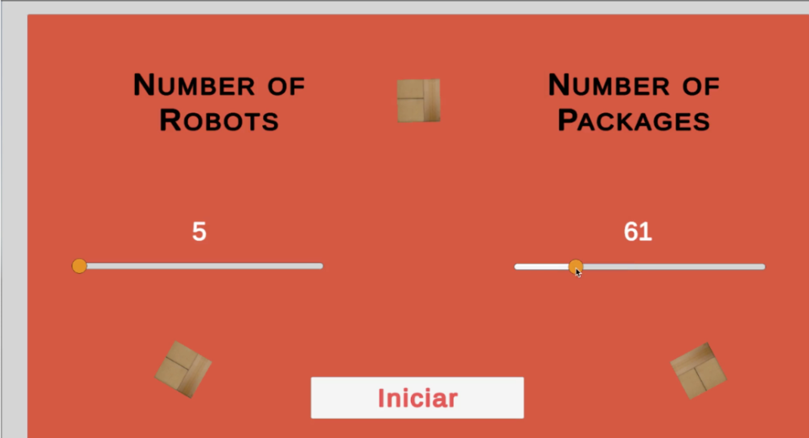

# PHOENIX

## Software Engineer – Elettric 80 Group (3D Warehouse Automation System)
*Technologies:* Python, Mesa, A* Search Algorithm, FastAPI, Unity

## Overview

Phoenix is a 3D warehouse automation software developed for E80, designed to automate the operations of Laser Guided Vehicles (LGVs) within a warehouse environment. This system simulates tasks such as unloading, storage, and truck reloading, reducing the need for human intervention. The backend is built in Python, using the Mesa library for agent-based modeling and the A* Search Algorithm for efficient pathfinding. Unity is used to provide real-time visualization of the warehouse and the interactions of LGVs.

## Features

•⁠  ⁠*Automated LGV Tasks:* Automates key LGV operations like unloading goods, storing them on shelves, and reloading them onto trucks, all with minimal human input.
•⁠  ⁠*3D Visualization:* Real-time simulation in Unity of the warehouse environment and LGV interactions.
•⁠  ⁠*Efficient Pathfinding:* Utilizes the A* Search Algorithm for optimal, collision-free routes for LGVs.
•⁠  ⁠*Backend Automation:* Python backend automates workflows, with the Mesa library used to model the behavior of LGVs and their environment.
•⁠  ⁠*Seamless Communication:* FastAPI enables real-time communication between the backend, LGV models, and other systems for smooth task execution.

## Technologies

•⁠  ⁠*Python:* Used to handle backend operations and LGV behavior modeling.
•⁠  ⁠*Mesa:* Agent-based modeling framework used to simulate LGV behavior and interactions.
•⁠  ⁠*A Search Algorithm:** Ensures efficient pathfinding and collision-free navigation.
•⁠  ⁠*FastAPI:* Provides real-time interaction between backend components and the simulation.
•⁠  ⁠*Unity:* Used to create a 3D simulation environment for visualizing LGV tasks in real time.

## How to Run

### Prerequisites

•⁠  ⁠Python 3.x
•⁠  ⁠Unity 2020.3 or higher
•⁠  ⁠FastAPI
•⁠  ⁠Mesa Library

### How It Works

1.⁠ ⁠*Warehouse Operations:*
   LGVs are tasked with collecting boxes from incoming trucks and placing them on storage shelves. Once the items are needed, LGVs retrieve them and load them onto outgoing trucks.

2.⁠ ⁠*Pathfinding and Optimization:*
   The A* Search Algorithm ensures that LGVs find the shortest, collision-free paths as they move through the warehouse, improving overall efficiency.

3.⁠ ⁠*Real-Time Communication:*
   FastAPI allows for real-time communication between the Python backend and the Unity simulation, ensuring that LGV actions and environmental changes are immediately reflected in the visualization.

## Future Improvements

•⁠  ⁠Add adjustable simulation time to allow users to control the duration of the simulation.
•⁠  ⁠Enhance LGV decision-making algorithms for better task prioritization and efficiency.
•⁠  ⁠Expand the simulation to handle larger warehouses with more LGVs and storage racks.
